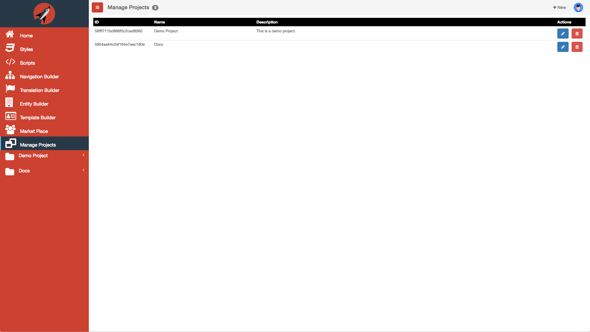
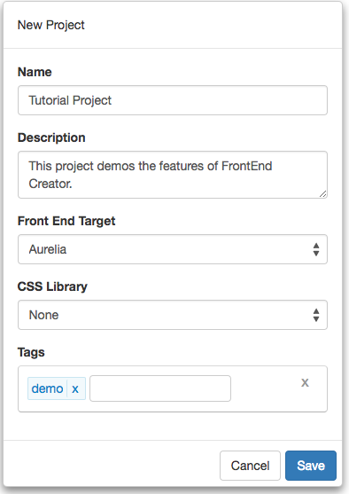
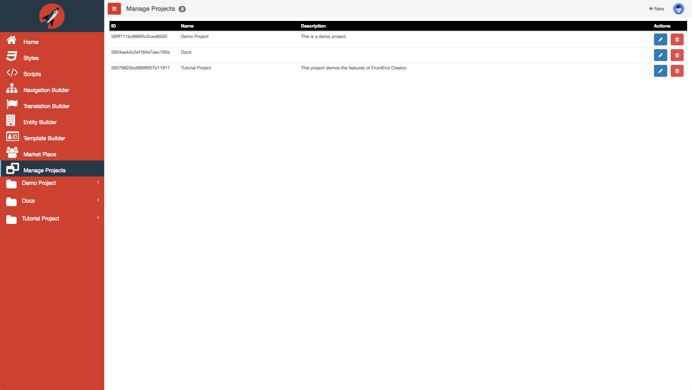
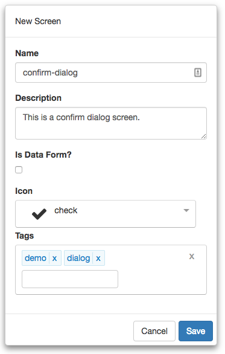
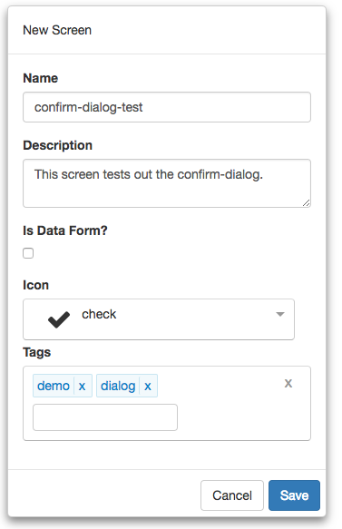
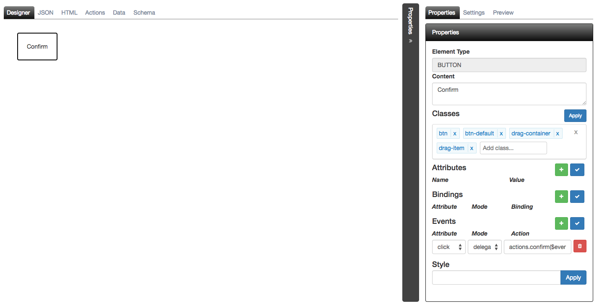
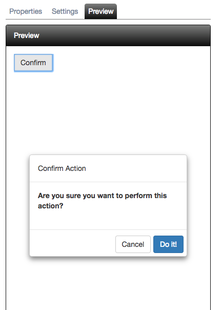

# Dialog Tutorial

The following are the steps required to use **FrontEnd Creator** and build a `confirm-dialog` screen:


  https://youtu.be/yqFTcCvbQMs


Let's get started.

1) Start by clicking on *Manage Projects* from navigation menu on the left pane.



2) Next, click on the New button and name the project, `Tutorial Project`. Add any description and leave the rest of the properties with their default values. You can add any tags you like to the project. Your should have something that looks like the following:



3) Once you click save, will notice that the project will automatically be added to the Manage Projects table as well as the navigation menu on the left:



4) Next, click on the Tutorial Project menu item from the navigation menu and select New Screen:


5) Name the screen, `confirm-dialog`. Add any description and pick any icon you wish for the screen. You can add any tags you like to the screen. You should have something that looks like the following:



6) Clicking save will navigate you to the designer.

7) Inside the designer, on the HTML tab, replace the contents with the following:

```html
<ai-dialog>
  <ai-dialog-header>
    Confirm Action
  </ai-dialog-header>

  <ai-dialog-body>
    <form submit.trigger="controller.ok(true)">
      <div class="form-group">
        <label for="fn">
          Are you sure you want to perform this action?
        </label>
      </div>
    </form>
  </ai-dialog-body>

  <ai-dialog-footer>
    <button class="btn btn-default" click.trigger="controller.cancel()">Cancel</button>
    <button class="btn btn-primary" click.trigger="controller.ok(true)">Do it!</button>
  </ai-dialog-footer>
</ai-dialog>
```

8) Save your work

> #### info::
> Copy the Screen ID, we will use this a little later

9) Okay, we have our dialog ready, now let's create another screen to test it

10) Next, click on the Tutorial Project menu item from the navigation menu and select New Screen:


11) Name the screen, `dialog-test`. Add any description and pick any icon you wish for the screen. You can add any tags you like to the screen. You should have something that looks like the following:



12) Clicking save will navigate you to the designer.

13) Drag a button onto the designer set its contents to: "Confirm"

14) Add a `click.delegate` to the button pointing to, "actions.confirm($event)". Your screen should look like the following:



15) In the `Actions` tab, make sure your code looks like the following:

```javascript
function (that, V) {

  function activate() {
    return that.actions.getResources();
  }

  function attached() {
  }

  function getResources() {
    let confirmDialogId = "<put screen id here...>";
    return Promise.all([
      that.dataService.findById(that.database, "screens", confirmDialogId)
    ]).then(values => {
      that.confirmDialog = values[0];
    }).catch(error => {
      console.error(error);
    });    
  }
  
  function confirm(e) {
    e.stopPropagation();
    let data = {};
    let payload = {screen: that.confirmDialog, owner: that, data: data};
    that.dialogService.show2(payload).then (response => {
      if (response && response.output) {
        that.notifier.growl({ message: "Action confirmed!" });
      }
    });
  }

  return {
    activate: activate,
    attached: attached,
    getResources: getResources,
    confirm: confirm
  };
}
```

Looking at the above code, you can see that we are loading the dialog when our view is activated. Next, we wire up the confirm function by creating a payload to use with the `dialogService`. This service wraps the `aurelia-dialog` and facilitates calling it and passing all the information it needs. 

> #### info::
> We can pass in any data that we like so that the dialog and use it as part of its workflow, if necessary. We also pass in a pointer to parent view model so that you want the dialog to perform a specific action, it can easily.

Finally, we show the dialog and then if it was an actionable response, we display a toast message. In our case, actionable was calling "ok" on the dialog controller passing it `true`. Again, you can pass back any value or object you like.

16) Remember to paste the Screen ID where it says, `<put screen id here...>`. Your screen should look the following with the exception of the value for the `confirmDialogId`:


17) Save your work.

18) You should now be able to test your dialog. Click on the `Preview` tab and click the `Confirm` button.

19) You should see something like the following:



20) If you click, "Do it!", then you should also see the following:


21) Otherwise, you will not see anything as the dialog did not pass back a response.

Congratulations! You have completed this tutorial!

> #### primary::
> Please refer to the [ Aurelia Dialog](https://github.com/aurelia/dialog) documentation to learn more about using dialogs.
