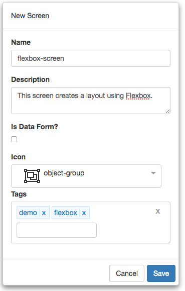

#Flexbox Screen Tutorial

Layout has always been a challenge when it comes to writing web applications forcing you to write an enormous amount of CSS or rely on a third-party library. Flexbox is one of the new kids on the block that has made this type of work easier, with minimal CSS. In this tutorial, we will be building the following layout, sometimes known as the holy grail in layout.


  https://youtu.be/Ed8R91uI8Ec


Let's get started.

1) Click on the *Styles* menu item from the navigation menu. Here we will add our style. Enter the following into the Style Properties pane:


2) Next, copy and paste the following code into the editor:

```css
:root {
  --content-padding: 15px;
}
.holy-grail header { 
  background-color: lightblue; 
  padding: var(--content-padding);
}
.holy-grail sidebar { 
  background-color: orange; 
  padding: var(--content-padding);
}
.holy-grail article { 
  background-color: cornsilk; 
  padding: var(--content-padding);
}
.holy-grail aside { 
  background-color: mistyrose; 
  padding: var(--content-padding);
}
.holy-grail footer { 
  background-color: lightgreen; 
  padding: var(--content-padding);
} 
```

3) As you can see from above, we are using CSS Variables. This is now supported in all modern browsers. 

4) Click the save button and the script should now show up on the left dock-pane.

5) We are now ready to start working on our screen.

6) Start by clicking on *Manage Projects* from navigation menu on the left pane.


7) Next, click on the New button and name the project, `Tutorial Project`. Add any description and leave the rest of the properties with their default values. You can add any tags you like to the project. Your should have something that looks like the following:


8) Once you click save, will notice that the project will automatically be added to the Manage Projects table as well as the navigation menu on the left:


9) Next, click on the Tutorial Project menu item from the navigation menu and select New Screen:


10) Name the screen, `flexbox-screen`. Add any description and pick any icon you wish for the screen. You can add any tags you like to the screen. You should have something that looks like the following:



11) Clicking save will navigate you to the designer.

12) Under the *Settings* tab select the flexbox-style style under the Screen Styles section.

13) We are now ready to start building our layout. There are a total of seven elements that we will use. The following is a table that breaks down each element with its Class and Content:

Element | Host | Class | Content
--- | --- | --- |---
DIV |  | flex-column full-height holy-grail | 
HEADER | DIV | flex-row-none | header content here...
MAIN | DIV | flex-row-1 | 
SIDEBAR | MAIN | flex-row-1 justify-content-center | sidebar content here...
ARTICLE | MAIN | flex-row-3 align-items-center justify-content-center | article content here...
ASIDE | MAIN | flex-row-1 | background-color: mistyrose;
FOOTER | DIV | flex-row-none justify-content-end | footer content here...

14) Save you work.

15) Click on the Preview button and you should see your layout like the following:


That's it! You have created your first Flexbox layout! Congratulations!
