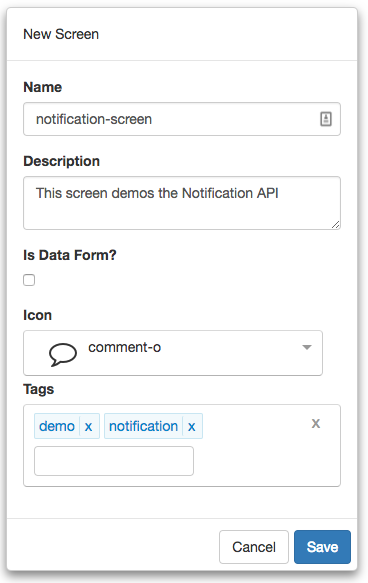
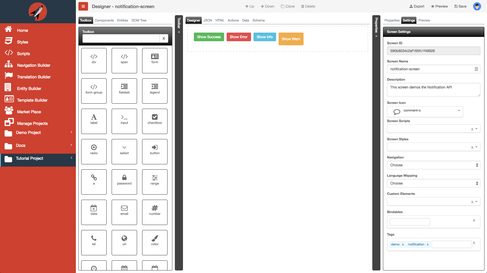

#Notification Tutorial

The following are the steps required to use **FrontEnd Creator** and build a `toast-screen` screen. This screen will take advantage of the Notifications API available.


  https://youtu.be/yqFTcCvbQMs


Let's get started.

1) Start by clicking on *Manage Projects* from navigation menu on the left pane.


2) Next, click on the New button and name the project, `Tutorial Project`. Add any description and leave the rest of the properties with their default values. You can add any tags you like to the project. Your should have something that looks like the following:


3) Once you click save, will notice that the project will automatically be added to the Manage Projects table as well as the navigation menu on the left:


4) Next, click on the Tutorial Project menu item from the navigation menu and select New Screen:


5) Name the screen, `notification-screen`. Add any description and pick any icon you wish for the screen. You can add any tags you like to the screen. You should have something that looks like the following:



6) Clicking save will navigate you to the designer.

7) We are now ready to start building our layout. This will be very simple markup. Copy the following markup and paste it into the HTML tab:

```html
<div class="flex-row-1">  
  <button tag="button" class="btn btn-success margin-5" 
    click.delegate="actions.notifySuccess()">Show Success  
  </button>  
  <button tag="button" class="btn btn-danger margin-5" 
    click.delegate="actions.notifyError()">Show Error  
  </button>  
  <button tag="button" class="btn btn-info margin-5" 
    click.delegate="actions.notifyInfo()">Show Info  
  </button>  
  <button tag="button" class="btn btn-warning margin-5" 
    click.delegate="actions.notifyWarn()">Show Warn  
  </button>
</div>
```

In the markup above, we are creating a simple Flexbox container. Next, we add buttons representing the individual types of notifications. We wire up the `click` delegate to call a function on the Actions tab.

8) The following is what your your screen should look like:



9) Save your work.

10) Now, let's add the functions that correspond to each `click` delegate binding.

```javascript
function (that, V) {

  function notifySuccess() {
    that.notifier.growl({type: 'success', message:'Success!'});
  }

  function notifyError() {
    that.notifier.growl({type: 'error', message:'Error!'});
  }

  function notifyInfo() {
    that.notifier.growl({type: 'info', message:'Info!'});
  }

  function notifyWarn() {
    that.notifier.growl({type: 'warn', message:'Warn!'});
  }

 return {
    notifySuccess: notifySuccess,
    notifyError: notifyError,
    notifyInfo: notifyInfo,
    notifyWarn: notifyWarn
  };
}
```

As you can see from above, we are simply referencing the `notifier` object and calling the `growl` function passing in our options.

11) Save your work.

12) The following animation demonstrates clicking on each button and see the notifications in action:


13) Congratulations! You have finished this tutorial!!
