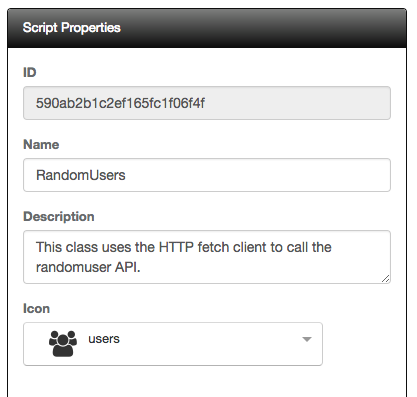
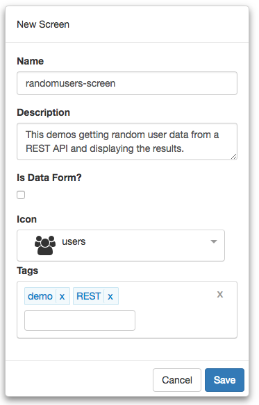

#REST API Screen Tutorial

This tutorial will walk you through creating a script that makes use of the HTTP fetch client and gets random user data from a REST API. Here is a screen shot of the layout we are going to build:


Let's get started.

1) Click on the *Scripts* menu item from the navigation menu. Here we will add our first script. Enter the following into the Script Properties pane:



2) Next, copy and paste the following code into the editor:

```javascript
@inject(HttpFetchClient)
class RandomUser {
  constructor(http) {
    this.http = http;
    this.baseUrl = `https://randomuser.me/`;
    this.http.configure(config => {
      config
        .withBaseUrl(this.baseUrl)
        .withDefaults({
          headers: {
            'Accept': 'application/json',
            'X-Requested-With': 'Fetch'
          }
        });
    });
  }

  getUsers(numberUsers = 10) {
    let path = `api?results=${numberUsers}`;
    return this.http.fetch(path)
      .then(response => response.json());
  }
}
```

3) As you can see, we are using a standard ES6 class. We are injecting the HttpFetchClient into our constructor. Inside the constructor, we are configuring our fetch client. Finally, we have a single method: `getUsers`. It takes a single parameter to tell us how many users to return from our call.

4) Click the save button and the script should now show up on the left dock-pane.

5) We are now ready to start working on our screen.

6) Start by clicking on *Manage Projects* from navigation menu on the left pane.


7) Next, click on the New button and name the project, `Tutorial Project`. Add any description and leave the rest of the properties with their default values. You can add any tags you like to the project. Your should have something that looks like the following:


8) Once you click save, will notice that the project will automatically be added to the Manage Projects table as well as the navigation menu on the left:


9) Next, click on the Tutorial Project menu item from the navigation menu and select New Screen:


10) Name the screen, `randomusers-screen`. Add any description and pick any icon you wish for the screen. You can add any tags you like to the screen. You should have something that looks like the following:



11) Clicking save will navigate you to the designer.

12) Under the *Settings* tab, select the `RandomUser` script under the Screen Scripts section.

13) We are now ready to start building our layout. There is only a single element that we will use.

14) Now, click on the HTML tab and copy and paste the following code into the editor:

```html
<div class="users drag-container drag-item">
  <style>
    .users {
      display: flex;
      flex-flow: column wrap;
      justify-content: center;
      align-items: center;
      height: 100%;
      background-color: lightgray;
    }
    .users .user {
      display: flex;
      flex-flow: column;
      flex: none;      
      align-items: center;
      background-color: white;
      border-radius: 5px;
      height: 200px;
      width: 185px;
      padding: 10px;
      margin: 15px;
    }
    .users .user img {
      flex: none;
      height: 150px;
      width: 150px;
    }
    .users .user span {
      flex: none;
      font-size: large;
    }
  </style>
  <div class="user drag-container drag-item" repeat.for="user of users">
    
    <span class="flex-1">${user.name.first} ${user.name.last}</span>
  </div>
</div>
```

15) Save you work.

16) Click the Actions tab and copy and paste the following code into the editor:

```javascript
function (that, V) {
  function attached() {
    that.randomUser = that.classBuilder(that.Script.RandomUser,
      that.Script.RandomUser_inject);
    return that.randomUser.getUsers(15)
      .then(data => that.users = data.results);
  }
  
  return {
    attached: attached
  };
}
```

**Note** We use `that` as a reference to the parent view model.
**Script** Take note that all scripts are referenced from the `Script` object.

We are using a helper function that is exposed by our hosting view-model, `classBuilder`. It is this function that does the actual creation and injection of our dependencies and returns us back an instance. As you can see, the `classBuilder` function expects two arguments: RandomUser and RandomUser_inject. **FrontEnd Creator** creates the second object for us when the screen is first initialized and a script has been included.

Next, we simply call the getUsers and then assign our `users` object once the promise returns.

17) Save your work.

18) Click on the Preview button and you should see something like the following:


19) Congratulations! You have finished this tutorial!!

