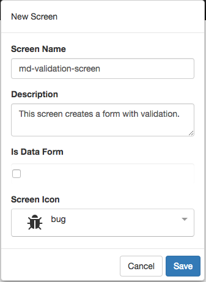
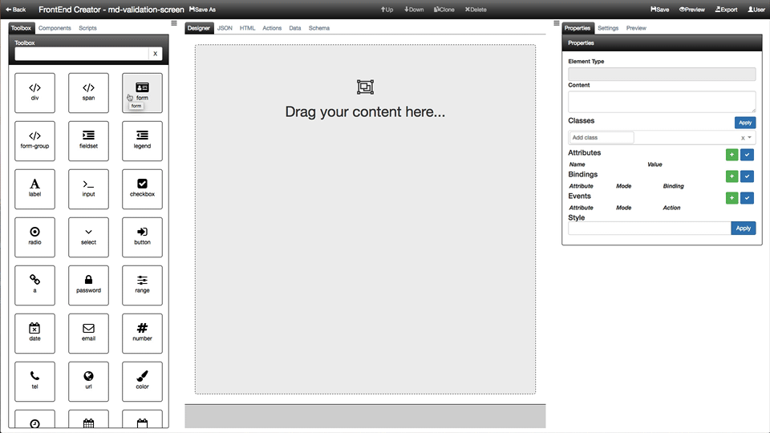
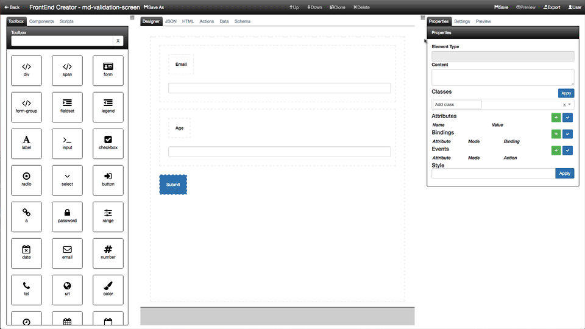

#Validation Screen Tutorial

The following are the steps required to use **FrontEnd Creator** to create a simple form with validation. Here is a screen shot of the layout we are going to build:


Let's get started.

1. Start by creating a project called, `Tutorial Project`. Add any description and left the rest of the properties with their default values. Your screen should look like the following:

  

2. Once you click save, you will go to the Project Dashboard. We will go straight to the screens.

  

3. Click on the plus button to add a new screen.

  
  
4. Now we are ready to start building our layout. There are a total of eight elements that we will use. We will create each individually using an animation that you can follow along.

  

  Here is a recap of each of the elements that were added and settings. In each element we set specific classes and styles. The following is a breakdown for each element:

  Element | Host | Class | Content
  ---- | ---- | ---- | ----
  FORM |  | full-height padding-15 | 
  FORM-GROUP | FORM | form-group | 
  LABEL | FORM-GROUP |  | Email
  INPUT | FORM-GROUP | form-control | 
  FORM-GROUP | FORM | form-group | 
  LABEL | FORM-GROUP |  | Age
  INPUT | FORM-GROUP | form-control | 
  BUTTON | FORM | btn btn-primary | Submit

  ## Attributes
  The following are the bindings on the elements:

  Element | Name | Value
  ---- | ---- | ---- | ----
  FORM | validator | data-context.bind: currentItem; schema.bind: schema; 
  FORM | data-context | dataContext

  ## Bindings
  The following are the bindings on the elements:

  Element | Attribute | Mode | Action
  ---- | ---- | ---- | ----
  INPUT | value | bind | currentItem.email
  INPUT | value | bind | currentItem.age

  ## Events
  The following are the events on the elements:

  Element | Attribute | Mode | Action
  ---- | ---- | ---- | ----
  BUTTON | click | delegate | actions.submit()

5. Save you work.

6. Click the Actions tab and enter the following code:

  ```javascript
  function (that, V) {

    function submit() {
      console.log(JSON.stringify(that.currentItem));
      if (that.validateFormFunc) {
        let isFormValid = that.validateFormFunc();
        if (!isFormValid) {
          that.notifier.growl({type: 'warn', message: `Please correct validation errors!`});
          return;
        }
        that.notifier.growl({type: 'success', message: `Form is valid!`});    
      }
    }
    
   return {
      submit: submit
    };
  }
  ```

  **Note** We use `that` as a reference to the parent view model.

7. Save your work.

8. Click the Data tab and enter the following JSON:

  ```json
  {
    "currentItem": {
      "email": "",
      "age": ""
    }
  }
  ```

9. Save your work.

10. Click on the Schema tab and enter the following JSON:

  ```javascript
  {
    "email": V.all([V.required(), V.email(null, "Not a valid email.")]),
    "age": V.all([V.required(), V.isNumeric(null, "Not a valid number.")])
  }
  ```

11. Save your work.

12. Click on the Preview button and you should see something like the following:

  

That it! You have created your first validation form! Congratulations!

[ Tutorials ](tutorials/tutorials)

