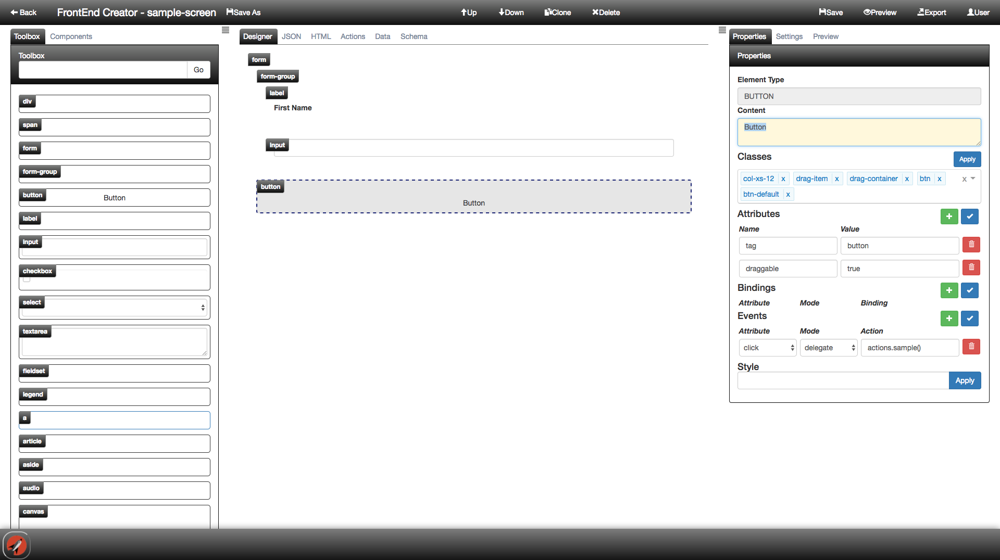
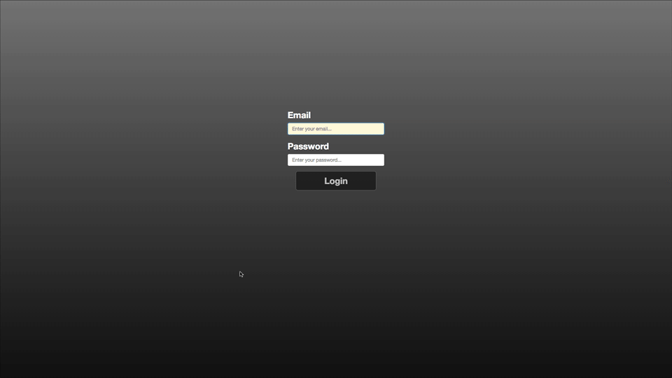
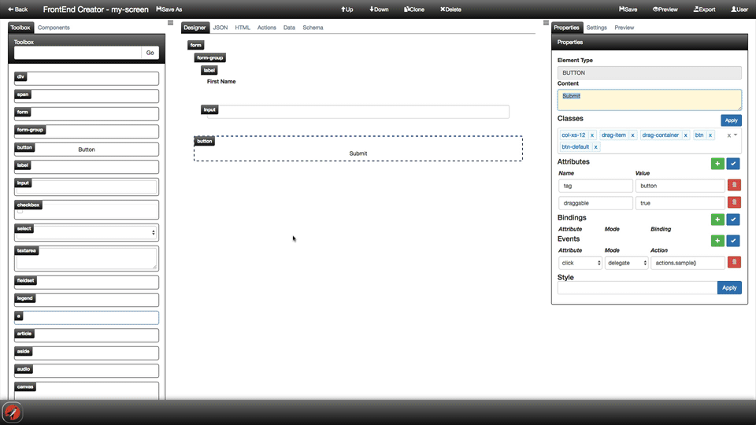

#Introducing FrontEnd Creator

Building applications with Aurelia has never been so much fun and the **FrontEnd Creator** makes it even more enjoyable. The tool allows you to group your applications into projects. Within each project you have multiple screens. You are able to drag and drop standard HTML elements as well as custom elements onto the designer surface. You can then configure properties of a selected element using the dynamic property grid. 

Everything is saved as JSON and you have the ability to live preview your changes immediately as well as share links for a given screen with co-workers or clients so that they can interact with your design.

## See it in action

The following animation shows how little work it takes to rapidly create a screen and preview it live using **FrontEnd Creator**:

You also have the ability to edit the HTML directly and see the changes reflected in the designer tab. Finally, you have the ability to preview your changes everytime you save your work or by launching a separate tab and viewing  your changes alone.

## Next steps

Currently, the **FrontEnd Creator** is in a *closed alpha*. If you are interested in participating and providing feedback, please contact: <support@frontendcreator.com>

Space is limited but you will have full access to the application.

For more information and documentation on using the application, please go here: [ Documentation ](https://bitbucket.org/matt.duffield/frontendcreator/wiki/Home)

We are striving to make this a first class solution for building web applications.

[ www.frontendcreator.com ](http://www.frontendcreator.com)
