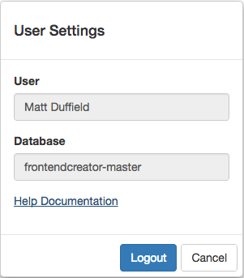

# Login

The following are the steps to login and start using the application.

## User Account
In order to use the application, you will need an account. Every user will have a profile associated with it that will determine your permissions within the application. The same security infrastructure that is in place in the application is available for the applications that you create.

## Logging In
You will need a username and password. Please contact <support@frontendcreator.com> to request a username and password. 

If you don't have a username and password, you can request one by clicking on the register link on the login screen.

## Advanced
If have signed up for multiple tiers, you will also be prompted with a dialog asking you which database you wish to select for your work. By default, all users will share the same database. 

## Logging out

It is possible to log out at any time after you have authenticated. Every screen has a user button in the top right corner. When you click on the button you will see the following dialog:

It is from this dialog that you can log out. You will also be able to verify the database and launch help documentation.

[ <- Previous ](home) | [ Next -> ](projects)
