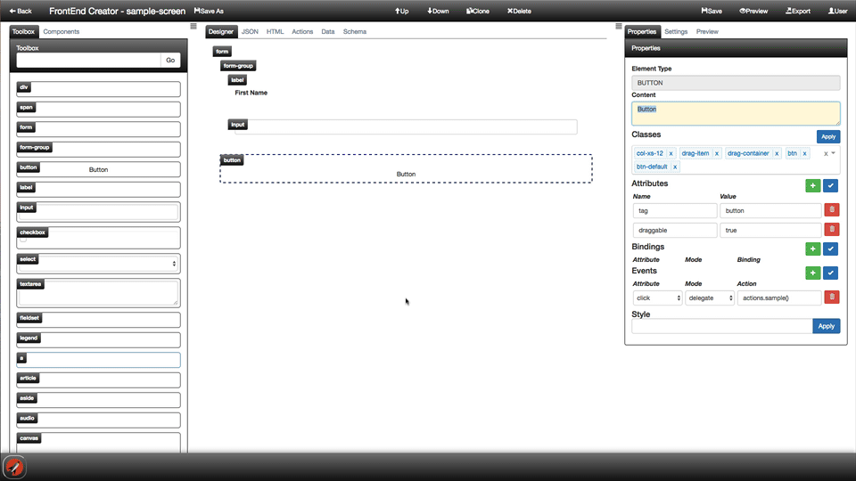

# Preview

The Preview screen allows you to test screens that you have created. It also allows you to send the link for a given screen to a user to review and test the screen without authenticating.

The following animation demonstrates launching a new browser tab to preview:

[ <- Previous ](designer.md) | [ Home ](Home.md) | [ Next -> ](classes-attributes-styles.md)

