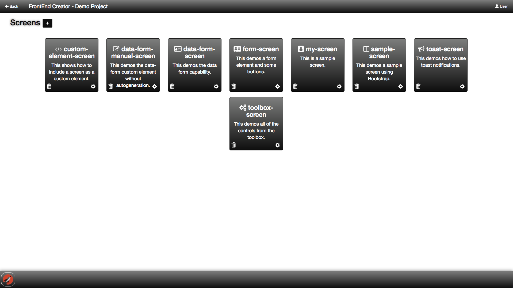
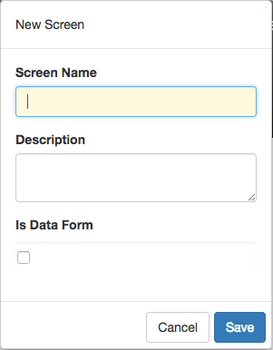

# Screens

After you have selected the project you want to work on, you will be presented with all of the available screens for that project. The following is a screen shot of some screens for a given project:

## Add/Edit Project Dialog

The following is a screen shot of the add/edit dialog that is displayed when you click on the + button or the cog icon:

Every screen has a screen name, description, and flag asking whether this is a Data Form. The checkbox allows you to quickly scaffold admin screens by walking the data provided. It also provides for validation and several settings on how to control validation as well as showing a validation summary.

### Note
The screen name is an important property. **FrontEnd Creator** will use it as the dynamic route when you preview your work. Therefore, it is important to be sure that you have a valid name entry. It is best not to put any spaces or special characters in the name.

Once you have saved your screen addition or modification, you will navigate immediately to the designer screen.

[ <- Previous ](projects.md) | [ Home ](Home.md) | [ Next -> ](designer.md)
